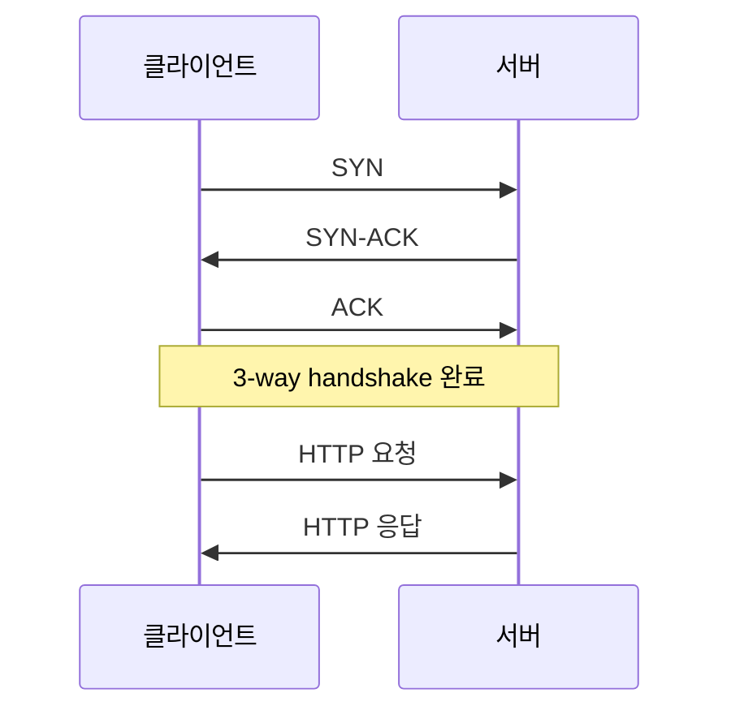
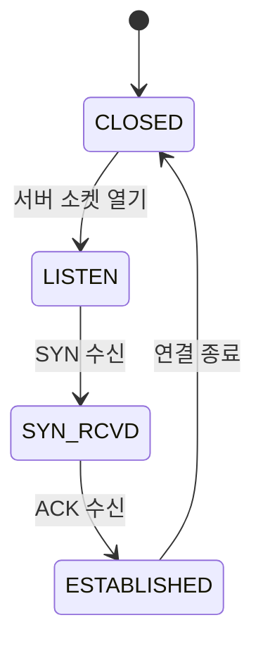

## 다이어그램




## 코드 하이라이팅

```c
#include <stdio.h>
#include <string.h>

// 간단한 버퍼 예제
int main(void) {
    char buf[16];
    strncpy(buf, "hello, world", sizeof(buf) - 1);
    buf[sizeof(buf) - 1] = '\0';

    printf("%s\n", buf);
    return 0;
}
```

```bash
# 열려 있는 포트 확인
ss -tuln

# 특정 프로세스가 연 파일 확인
lsof -p <PID>
```

## 인라인 요소들

문장 중간에 `malloc()` 같은 인라인 코드도 쓸 수 있고, **굵게**나 *기울임*도 됩니다. [링크](https://gohugo.io)도 이렇게 걸립니다.

> 인용문은 이렇게 표시됩니다. 공부하다 인상 깊었던 문장을 남길 때 쓰면 좋겠습니다.