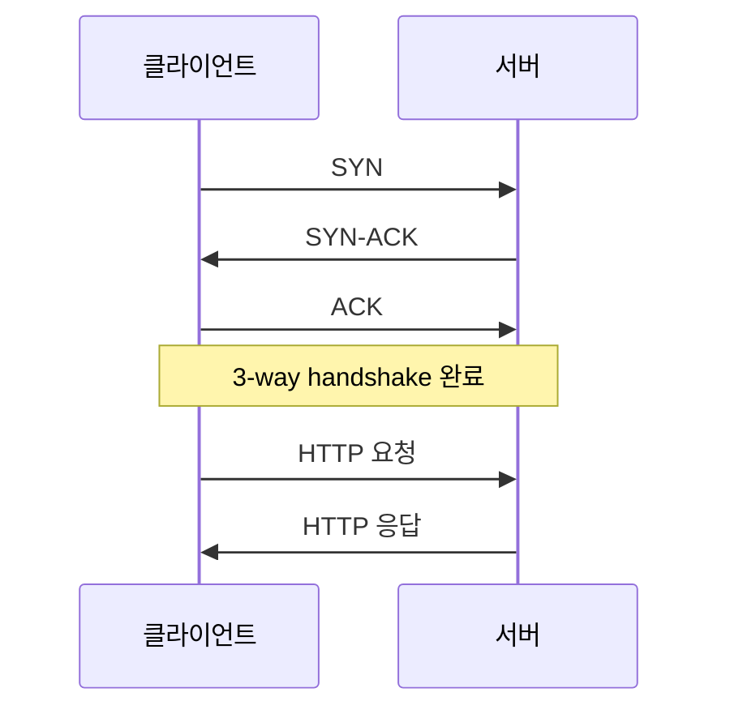
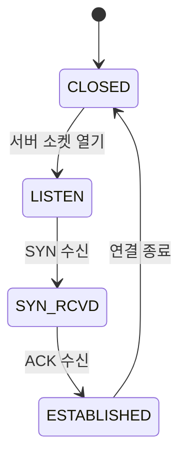

블로그를 열었습니다. 이 글은 앞으로 시스템 프로그래밍(OS·보안)과 네트워크를 공부하며 남길 기록의 첫 페이지이자, 블로그 기능이 제대로 작동하는지 확인하는 테스트 글입니다.

## 다이어그램은 잘 나올까

패킷이 클라이언트에서 서버로 갔다가 돌아오는 과정을 그려봤습니다. 시스템/네트워크 글에서는 이런 흐름도를 자주 그리게 될 것 같습니다.



상태 전이도 같은 것도 이렇게 표현할 수 있습니다.



## 코드 하이라이팅 확인

C 코드도 색이 잘 입혀지는지 봅니다. 줄번호와 복사 버튼도 함께 확인할 수 있습니다.

```c
#include <stdio.h>
#include <string.h>

// 간단한 버퍼 예제
int main(void) {
    char buf[16];
    strncpy(buf, "hello, world", sizeof(buf) - 1);
    buf[sizeof(buf) - 1] = '\0';

    printf("%s\n", buf);
    return 0;
}
```

셸 명령어도 자주 기록하게 될 것 같습니다.

```bash
# 열려 있는 포트 확인
ss -tuln

# 특정 프로세스가 연 파일 확인
lsof -p <PID>
```

## 인라인 요소들

문장 중간에 `malloc()` 같은 인라인 코드도 쓸 수 있고, **굵게**나 *기울임*도 됩니다. [링크](https://gohugo.io)도 이렇게 걸립니다.

> 인용문은 이렇게 표시됩니다. 공부하다 인상 깊었던 문장을 남길 때 쓰면 좋겠습니다.

## 앞으로 다룰 것

- 시스템 프로그래밍: 메모리 구조, 프로세스, 시스템 콜
- 보안: 취약점 분석, 익스플로잇 실습 기록
- 네트워크: 프로토콜 분석, 패킷 캡처, 소켓 프로그래밍

이 글이 잘 보인다면 블로그 세팅은 성공입니다.
